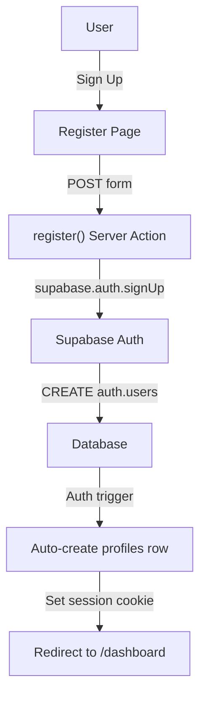

# 📘 MERVASON - CAHIER DE CHARGE & ARCHITECTURE COMPLÈTE

**Date:** 28 Avril 2026  
**Status:** ~85% terminé (Phase 4 complétée, Phase 5 en cours)  
**Version:** 1.0 - Document d'audit exhaustif

---

## TABLE DES MATIÈRES
1. [Vision Produit](#vision-produit)
2. [Stack Technique](#stack-technique)
3. [Design System](#design-system)
4. [Architecture Base de Données](#architecture-base-de-données)
5. [Architecture Application](#architecture-application)
6. [Authentification & Sécurité](#authentification--sécurité)
7. [État d'Avancement Détaillé](#état-davancement-détaillé)
8. **[PROBLÈMES IDENTIFIÉS & SOLUTIONS](#problèmes-identifiés--solutions)** ⚠️
9. [Checklist Déploiement](#checklist-déploiement)
10. [Commandes Utiles](#commandes-utiles)

---

## VISION PRODUIT

### Concept
**Mervason** = Marketplace (E-commerce) multi-vendeurs simplifié (MVP)

**No Shopping Cart, No Online Payment**
- Clients cliquent sur produit → voient détails + formulaire de livraison
- Message WhatsApp pré-rempli auto-généré → contact vendeur directement
- Vendeur répond + accepte commande + arrange livraison
- Paiement = cash on delivery (COD) ou paiement direct WhatsApp

### Valeur Ajoutée
- **Pour clients:** Découvrir produits locaux, contacter direct sans panier
- **Pour vendeurs:** Page boutique publique, CRUD produits, limites par plan
- **Pour admin:** Dashboard, gérer plans, modérer boutiques

### Cible
- Cameroun 🇨🇲 (Phase 1)
- Économie informelle (petits commerçants, artisans)
- Mobile-first users (WhatsApp omnipotent)

---

## STACK TECHNIQUE

### Frontend
```
Next.js 16.1.1 (App Router)
├─ TypeScript 5.x (type safety)
├─ React 19.x
├─ TailwindCSS v4 (utility-first CSS)
├─ Lucide Icons (open-source icons)
├─ React Hot Toast (notifications)
└─ Sonner (alternative toast)
```

### Backend / API
```
Server Actions (Next.js)
├─ No explicit API routes
├─ Direct database access from actions
├─ Built-in form handling
└─ Server-side execution (secure)
```

### Authentication & Database
```
Supabase (PostgreSQL + Auth)
├─ Email/Password Auth
├─ RLS (Row Level Security) policies
├─ Realtime subscriptions (optional)
└─ Storage (product-images, shop-logos)
```

### Deployment
```
Vercel
├─ Edge deployment (global CDN)
├─ Automatic CI/CD from Git
├─ Environment variables managed
└─ Serverless functions (Server Actions)
```

### Testing
```
Playwright @playwright/test
├─ E2E tests
├─ Cross-browser testing
├─ Mobile device emulation
└─ Test reports (HTML)
```

---

## DESIGN SYSTEM

### Palette Couleurs

| Usage | Couleur | Code | Utilisation |
|-------|---------|------|-------------|
| **Action CTA** | Orange vif | `#F97316` | Boutons primaires, accents |
| **Confiance** | Bleu profond | `#1E40AF` | Boutons secondaires, trustworthiness |
| **Erreur** | Rouge | `#EF4444` | Validations, alerts |
| **Succès** | Vert | `#22C55E` | Confirmations, success states |
| **Fond** | Blanc/Gris clair | `#F3F4F6` | Page backgrounds |
| **Texte** | Gris foncé | `#1F2937` | Body text |

### Typographie
```
- Display:     font-bold text-4xl md:text-6xl
- Heading:     font-bold text-2xl md:text-4xl
- Subheading:  font-semibold text-lg md:text-xl
- Body:        font-normal text-base
- Small:       font-normal text-sm
- Tiny:        font-normal text-xs
```

### Composants Primitifs

#### Button
```tsx
<Button variant="primary|secondary|ghost|destructive" size="sm|md|lg">
  Label
</Button>
```
- **primary:** Orange (#F97316) - main CTAs
- **secondary:** Blue (#1E40AF) - alternative actions
- **ghost:** Transparent - subtle links
- **destructive:** Red - dangerous actions

#### Card
```tsx
<Card variant="glass|default">
  <CardHeader>
    <CardTitle>Title</CardTitle>
    <CardDescription>Description</CardDescription>
  </CardHeader>
  <CardContent>Content</CardContent>
  <CardFooter>Actions</CardFooter>
</Card>
```

**Glassmorphism:** `bg-white/80 backdrop-blur-md border border-white/20`

#### Input
```tsx
<Input 
  type="email|text|number|tel"
  placeholder="..."
  error={boolean}
  disabled={boolean}
/>
```

#### Label
```tsx
<Label htmlFor="input-id">Label Text</Label>
```

#### Badge
```tsx
<Badge variant="success|warning|error|info">
  Label
</Badge>
```
- **Variants:** success (vert), warning (orange), error (rouge), info (bleu)
- **Optional pulse animation:** `<Badge pulse>`

### Responsive Breakpoints
```
- Mobile:        < 640px  (default)
- Tablet:        640px+   (@sm)
- Desktop:       768px+   (@md)
- Large Desktop: 1024px+  (@lg)
- XL:            1280px+  (@xl)
```

### Accessibility
- ✅ Focus rings (focus-visible:ring-2 focus-visible:ring-offset-2)
- ✅ Color contrast (WCAG AA minimum)
- ✅ Semantic HTML (button, link, label, etc.)
- ✅ Alt text pour images
- ✅ Keyboard navigation (Tab, Enter, Escape)

---

## ARCHITECTURE BASE DE DONNÉES

### Modèle Entités

#### 1. PROFILES (Utilisateurs)
```sql
profiles {
  id UUID PRIMARY KEY → auth.users(id) ON DELETE CASCADE
  first_name TEXT
  last_name TEXT
  avatar_url TEXT
  is_admin BOOLEAN DEFAULT FALSE
  is_merchant BOOLEAN DEFAULT FALSE
  created_at TIMESTAMPTZ DEFAULT NOW()
  updated_at TIMESTAMPTZ DEFAULT NOW()
}
```
**Créé automatiquement via trigger** lors de `auth.users` creation

#### 2. CATEGORIES (Catégories de produits)
```sql
categories {
  id SERIAL PRIMARY KEY
  name TEXT NOT NULL (ex: "Cheveux", "Électronique")
  slug TEXT UNIQUE NOT NULL (ex: "cheveux", "electronique")
  icon_slug TEXT (ex: "hair-1", "zap")
  created_at TIMESTAMPTZ DEFAULT NOW()
}
```
**Pré-remplies** via migration `seed-categories.sql`

#### 3. SHOPS (Boutiques vendeurs)
```sql
shops {
  id UUID PRIMARY KEY DEFAULT gen_random_uuid()
  owner_id UUID NOT NULL → profiles(id) ON DELETE CASCADE
  name TEXT NOT NULL
  slug TEXT UNIQUE NOT NULL
  description TEXT
  whatsapp_number TEXT NOT NULL (Format Cameroun: +237XXXXXXXXX)
  logo_url TEXT → Supabase Storage (shop-logos bucket)
  plan_id INTEGER → plans(id) DEFAULT 1 (plan Gratuit)
  is_active BOOLEAN DEFAULT TRUE
  deactivated_at TIMESTAMPTZ (Timestamp if suspended by admin)
  created_at TIMESTAMPTZ DEFAULT NOW()
  updated_at TIMESTAMPTZ DEFAULT NOW()

  UNIQUE(owner_id) -- One shop per user
  INDEX idx_shops_owner(owner_id)
  INDEX idx_shops_slug(slug)
}
```

#### 4. PRODUCTS (Produits en vente)
```sql
products {
  id UUID PRIMARY KEY DEFAULT gen_random_uuid()
  shop_id UUID NOT NULL → shops(id) ON DELETE CASCADE
  category_id INTEGER → categories(id) ON DELETE SET NULL
  title TEXT NOT NULL
  slug TEXT NOT NULL
  description TEXT
  price NUMERIC(10, 2) NOT NULL CHECK (price >= 0)
  images TEXT[] (JSON array of image URLs from Storage)
  stock INTEGER DEFAULT 0 CHECK (stock >= 0)
  is_active BOOLEAN DEFAULT TRUE
  created_at TIMESTAMPTZ DEFAULT NOW()
  updated_at TIMESTAMPTZ DEFAULT NOW()

  UNIQUE(shop_id, slug) -- Slug unique per shop only
  INDEX idx_products_shop(shop_id)
  INDEX idx_products_category(category_id)
  INDEX idx_products_active(is_active) WHERE is_active = TRUE
}
```

#### 5. PLANS (Pricing tiers)
```sql
plans {
  id SERIAL PRIMARY KEY
  name TEXT NOT NULL (ex: "Gratuit", "Standard", "Premium")
  price INTEGER NOT NULL (Price in XAF, 0 for free)
  product_limit INTEGER NOT NULL
  created_at TIMESTAMPTZ DEFAULT NOW()
}
```
**Pré-remplies:** 3 plans existants

### RLS (Row Level Security) Policies

#### Products Policy
```sql
-- Public READ access (is_active = true)
SELECT: ✅ Authentic & Public
  USING (is_active = true AND stock > 0)

-- Shop owner WRITE access
INSERT: ✅ shop_owner_id = auth.uid()
UPDATE: ✅ shop_owner_id = auth.uid()
DELETE: ✅ shop_owner_id = auth.uid()
```

#### Shops Policy
```sql
-- Public READ access
SELECT: ✅ Authentic & Public
  USING (is_active = true)

-- Owner WRITE access
UPDATE: ✅ owner_id = auth.uid()
```

#### Profiles Policy
```sql
-- Read own profile
SELECT: ✅ id = auth.uid() OR is_admin = true
```

### Storage Buckets

#### 1. `product-images` (Public)
```
Structure:
  product-images/
    {user_id}/
      {product_id}/
        {timestamp}_{filename}.{ext}

RLS Policies:
  INSERT: ✅ (string_to_array(name, '/'))[1] = auth.uid()
  SELECT: ✅ public
  DELETE: ✅ (string_to_array(name, '/'))[1] = auth.uid()
```

#### 2. `shop-logos` (Public) ⚠️ **NEEDS CONFIGURATION**
```
Structure:
  shop-logos/
    {shop_id}/
      logo.{ext}

RLS Policies:
  ❌ NOT YET CONFIGURED (BLOCKING ISSUE)
  INSERT: ✅ owner_id = auth.uid()
  SELECT: ✅ public
  DELETE: ✅ owner_id = auth.uid()
```

---

## ARCHITECTURE APPLICATION

### Routes & Navigation Map

```
/
├── (public)
│   ├── /                                    (Landing Page + Featured Products)
│   ├── /products                            (Products Listing + Category Filter)
│   ├── /products/[slug]                     (Product Detail Page)
│   ├── /shop/[slug]                         (Shop Public Page)
│   ├── /pricing                             (Pricing Page + FAQ)
│   ├── /auth/login                          (Login Form)
│   └── /auth/register                       (Registration Form)
│
├── /dashboard/*                             (Protected: Merchant only)
│   ├── /dashboard                           (Dashboard Home - Plan/Products Summary)
│   ├── /dashboard/products                  (Products List Table)
│   ├── /dashboard/products/add              (Add Product Form)
│   ├── /dashboard/products/[id]/edit        (Edit Product Form)
│   └── /dashboard/settings                  (Shop Settings - Logo, Name, WhatsApp)
│
└── /admin/*                                 (Protected: Admin only)
    ├── /admin                               (Admin Dashboard - KPIs)
    ├── /admin/users                         (Users Management Table)
    ├── /admin/shops                         (Shops Management Table)
    ├── /admin/shops/[id]                    (Shop Details + Actions)
    └── /admin/products                      (Products Management)
```

### File Structure

```
/app
├── layout.tsx                          Root layout (Navbar global)
├── page.tsx                            Landing page
├── error.tsx                           Global error boundary
├── not-found.tsx                       Custom 404
├── globals.css                         Global styles + animations
│
├── auth/
│   ├── layout.tsx
│   ├── login/page.tsx
│   └── register/page.tsx
│
├── products/
│   ├── page.tsx                        Products listing with filter
│   ├── loading.tsx                     Skeleton loader
│   └── [slug]/
│       ├── page.tsx                    Product details
│       ├── loading.tsx
│       └── error.tsx
│
├── shop/
│   └── [slug]/
│       ├── page.tsx                    Shop public page
│       ├── loading.tsx
│       └── error.tsx
│
├── dashboard/
│   ├── layout.tsx                      Dashboard layout + sidebar
│   ├── page.tsx                        Dashboard home
│   ├── products/
│   │   ├── page.tsx                    Products list
│   │   ├── [id]/edit/page.tsx
│   │   └── add/page.tsx
│   └── settings/page.tsx               Shop settings
│
└── admin/
    ├── layout.tsx
    ├── page.tsx                        Admin dashboard KPIs
    ├── users/page.tsx
    ├── shops/page.tsx
    └── shops/[id]/page.tsx
```

```
/components
├── ui/                                 Design System primitives
│   ├── button.tsx
│   ├── card.tsx
│   ├── input.tsx
│   ├── label.tsx
│   ├── badge.tsx
│   └── skeleton.tsx
│
├── features/                           Business logic components
│   ├── product-card.tsx                Reusable product card
│   ├── product-gallery.tsx             Image gallery with thumbnails
│   ├── product-form.tsx                Add/Edit form
│   ├── product-form.tsx
│   ├── order-form.tsx                  Livraison form (client)
│   ├── shop-form.tsx                   Create shop form
│   ├── shop-settings-form.tsx          Edit shop settings
│   ├── image-upload.tsx                Image uploader
│   ├── category-filter.tsx             Filter dropdown
│   ├── whatsapp-button.tsx             WhatsApp CTA button
│   ├── delete-product-button.tsx       Confirmation + delete
│   └── contact-admin-button.tsx        Plan upgrade button
│
├── admin/
│   ├── admin-actions-menu.tsx          Suspend/Activate/Upgrade shop
│   └── shop-status-badge.tsx
│
├── pricing/
│   ├── pricing-card.tsx
│   └── contact-admin-button.tsx
│
└── layouts/
    ├── navbar.tsx                      Top navigation
    └── footer.tsx                      ⚠️ MISSING
```

```
/lib
├── utils.ts                            Helpers (formatPrice, cn, generateSlug)
├── auth-helpers.ts                     getCurrentUser, isAdmin, etc.
│
└── actions/                            Server Actions
    ├── auth.ts                         register, login, logout
    ├── products.ts                     createProduct, updateProduct, deleteProduct
    ├── shops.ts                        createShop, updateShop, uploadShopLogo
    ├── upload.ts                       uploadProductImage, deleteProductImage
    └── admin.ts                        Admin actions
```

```
/utils
├── supabase/
│   ├── client.ts                       Client-side Supabase
│   └── server.ts                       Server-side Supabase + middleware
└── middleware.ts                       Auth protection for /dashboard, /admin
```

### Data Flow Patterns

#### Pattern 1: Server Component → Server Action → Database
```tsx
// app/dashboard/products/add/page.tsx (Server Component)
export default async function AddProductPage() {
  const categories = await fetchCategories() // Supabase
  
  return (
    <ProductForm 
      action={createProduct}  // Server Action
      categories={categories}
    />
  )
}

// components/features/product-form.tsx (Client Component for form interactivity)
export function ProductForm({ action, categories }) {
  return (
    <form action={action}>  // FormData → Server Action
      <Input name="title" />
      <button type="submit">Add</button>
    </form>
  )
}

// lib/actions/products.ts (Server Action)
export async function createProduct(formData: FormData) {
  const supabase = await createServerClient()
  // Insert to database
  // Redirect or revalidate
}
```

#### Pattern 2: Client Component → useState → fetch Server Action
```tsx
// components/features/image-upload.tsx (Client Component)
export function ImageUpload({ onImagesChange }) {
  const [images, setImages] = useState([])
  
  const handleFileChange = async (files) => {
    const formData = new FormData()
    formData.append('file', files[0])
    
    const url = await uploadProductImage(formData) // Server Action
    setImages([...images, url])
    onImagesChange([...images, url])
  }
  
  return (...)
}
```

---

## AUTHENTIFICATION & SÉCURITÉ

### Auth Flow



### Session Management
```
1. User signs up/logs in → Supabase sets session cookie
2. Middleware intercepts requests
3. middleware.ts extracts session from cookie
4. Refreshes token if expired (automatic)
5. Updates response cookie
6. Stores session in request context
```

### Protected Routes
```
/dashboard/*     → Requires auth + merchant flag
/admin/*         → Requires auth + admin flag
/auth/login      → Redirects if already authenticated
/auth/register   → Redirects if already authenticated
```

### Security Best Practices
- ✅ No secrets exposed (env variables)
- ✅ RLS policies enforce data access
- ✅ CSRF protection (Next.js builtin)
- ✅ Input validation (server-side)
- ✅ Zod schema validation (optional)
- ✅ WhatsApp numbers format validated (+237 Cameroun)

---

## ÉTAT D'AVANCEMENT DÉTAILLÉ

### ✅ COMPLÉTÉES (85%)

#### Phase 1: Fondations ✅
- [x] Setup Next.js 14 + TypeScript
- [x] Configuration Supabase (auth, database)
- [x] Design System (6 composants UI primitifs)
- [x] Layout global + Navbar responsive
- [x] Glassmorphism styling

#### Phase 2: Authentification ✅
- [x] Pages login/register avec Server Actions
- [x] Middleware protection `/dashboard` et `/admin`
- [x] Trigger DB auto-création profil
- [x] Logout avec cookie clearing
- [x] Role-based access (is_admin, is_merchant)

#### Phase 3: Dashboard Vendeur ✅
- [x] Dashboard home (KPI: plan, produits)
- [x] Création boutique (slug auto-généré)
- [x] Liste produits avec table
- [x] Add product form
- [x] Edit product form
- [x] Delete product with confirmation
- [x] Upload images (produits)
- [x] Shop settings form

#### Phase 4: Pages Publiques ✅ (~85%)
- [x] Landing page avec hero section
- [x] Page produits listing + category filter
- [x] Page produit détaillée
- [x] SEO (Open Graph, JSON-LD, ISR)
- [x] Page boutique publique
- [x] Formulaire livraison client
- [x] Message WhatsApp pré-rempli
- [x] Badges stock + animations

#### Bonus: Admin Dashboard ✅
- [x] Admin KPI cards (users, shops, products count)
- [x] Admin users table
- [x] Admin shops table + details
- [x] Admin actions (suspend, activate, upgrade plan)
- [x] Shop status badge

#### Pricing System ✅
- [x] 3 plans configurés (Free 20, Standard 50, Premium 100 produits)
- [x] Pricing page avec comparaison
- [x] Plan badge on dashboard
- [x] Product limit enforcement

### ⏳ À FAIRE (15%)

#### Phase 5: Polish & Validation

##### STEP 5.1: Bug Fixes & Configuration ⚠️
- [ ] **Fix: Category filter texte invisible** (see below)
- [ ] **Fix: Shop logo upload échoue** (see below)
- [ ] **Add: Footer component** (see below)
- [ ] Test tous les flows
- [ ] Vérifier responsive mobile réel

##### STEP 5.2: Error Handling
- [ ] Créer `error.tsx` pour chaque route
- [ ] Gérer erreurs Supabase connection
- [ ] Améliorer fallbacks loading
- [ ] Toast notifications pour erreurs

##### STEP 5.3: Performance & SEO
- [ ] Lighthouse audit (>90)
- [ ] Optimiser images (next/image)
- [ ] Vérifier bundle size
- [ ] ISR en production

##### STEP 5.4: Tests & QA
- [ ] Tests Playwright E2E
- [ ] Test cross-browser (Chrome, Firefox, Safari)
- [ ] Test responsive (mobile, tablet, desktop)
- [ ] Test WhatsApp real device

---

## PROBLÈMES IDENTIFIÉS & SOLUTIONS

### 🔴 PROBLÈME #1: Texte invisible - Category Filter

**Location:** `components/features/category-filter.tsx`  
**Symptom:** Zone filtres catégories texts not visible

**Root Cause:**
```tsx
// Line 49-54
<select
  className="px-4 py-2 border border-gray-300 rounded-lg 
             focus:outline-none focus:ring-2 focus:ring-orange-500 
             focus:border-transparent bg-white"
>
```
- `bg-white` sans `text-gray-900` explicite
- Les options du select peuvent avoir couleur de texte par défaut (peut être blanche)

**Solution:**
```tsx
<select
  className="px-4 py-2 border border-gray-300 rounded-lg 
             focus:outline-none focus:ring-2 focus:ring-orange-500 
             focus:border-transparent bg-white text-gray-900 font-medium"
>
  <option value="all" className="text-gray-900">Toutes les catégories</option>
  {categories.map((category) => (
    <option key={category.id} value={category.id} className="text-gray-900">
      {category.name}
    </option>
  ))}
</select>
```

---

### 🔴 PROBLÈME #2: Upload image boutique échoue

**Location:** `/dashboard/settings` (Shop logo upload)  
**Error Message:** "Échec du téléchargement. Veuillez réessayer."  
**User Action:** Clicking "Ajouter un logo"

**Root Cause:**
Bucket `shop-logos` n'existe pas OR RLS policies ne sont pas configurées

**Verification Steps:**
1. Vérifier que bucket existe dans Supabase Storage
2. Vérifier RLS policies sur bucket

**Solution:**

**Step 1: Créer le bucket (si n'existe pas)**
```sql
-- Supabase SQL Editor → New Query → Run
INSERT INTO storage.buckets (id, name, public, file_size_limit, allowed_mime_types)
VALUES (
  'shop-logos',
  'shop-logos',
  true,
  2097152,  -- 2MB limit
  ARRAY['image/jpeg', 'image/png', 'image/webp']::text[]
)
ON CONFLICT (id) DO NOTHING;
```

**Step 2: Configurer RLS Policies**
```sql
-- Drop old policies (if exists)
DROP POLICY IF EXISTS "Authenticated users can upload shop logos" ON storage.objects;
DROP POLICY IF EXISTS "Public read shop logos" ON storage.objects;
DROP POLICY IF EXISTS "Users can delete their shop logo" ON storage.objects;

-- Policy 1: INSERT (Upload)
CREATE POLICY "Authenticated users can upload shop logos"
ON storage.objects
FOR INSERT
TO authenticated
WITH CHECK (
  bucket_id = 'shop-logos'
);

-- Policy 2: SELECT (Public read)
CREATE POLICY "Public read shop logos"
ON storage.objects
FOR SELECT
TO public
USING (bucket_id = 'shop-logos');

-- Policy 3: DELETE (Delete own)
CREATE POLICY "Users can delete their shop logo"
ON storage.objects
FOR DELETE
TO authenticated
USING (
  bucket_id = 'shop-logos' AND
  (string_to_array(name, '/'))[1] = auth.uid()::text
);
```

---

### 🟡 PROBLÈME #3: Pas de Footer

**Location:** `app/layout.tsx`  
**Impact:** Léger (MVP), mais standard pour UX/SEO

**Current:**
```tsx
<body>
  <Navbar user={user} />
  <main className="min-h-screen">
    {children}
  </main>
  {/* NO FOOTER */}
  <Toaster position="top-right" />
</body>
```

**Solution: Créer Footer Component**

```tsx
// components/layouts/footer.tsx
export function Footer() {
  return (
    <footer className="bg-gray-900 text-gray-100 border-t border-gray-800">
      <div className="max-w-7xl mx-auto px-4 sm:px-6 lg:px-8">
        {/* Main Footer */}
        <div className="grid grid-cols-1 md:grid-cols-4 gap-8 py-12">
          {/* Brand */}
          <div>
            <h3 className="text-lg font-bold text-orange-500 mb-4">Mervason</h3>
            <p className="text-sm text-gray-400">
              Découvrez les meilleurs produits locaux sur notre marketplace
            </p>
          </div>

          {/* Quick Links */}
          <div>
            <h4 className="font-semibold mb-4">Navigation</h4>
            <ul className="space-y-2 text-sm">
              <li><Link href="/" className="hover:text-orange-400">Accueil</Link></li>
              <li><Link href="/products" className="hover:text-orange-400">Produits</Link></li>
              <li><Link href="/pricing" className="hover:text-orange-400">Tarifs</Link></li>
            </ul>
          </div>

          {/* For Sellers */}
          <div>
            <h4 className="font-semibold mb-4">Pour Vendeurs</h4>
            <ul className="space-y-2 text-sm">
              <li><Link href="/auth/register" className="hover:text-orange-400">Créer compte</Link></li>
              <li><Link href="/dashboard" className="hover:text-orange-400">Dashboard</Link></li>
            </ul>
          </div>

          {/* Legal */}
          <div>
            <h4 className="font-semibold mb-4">Légal</h4>
            <ul className="space-y-2 text-sm">
              <li><a href="#" className="hover:text-orange-400">CGU</a></li>
              <li><a href="#" className="hover:text-orange-400">Politique</a></li>
              <li><a href="#" className="hover:text-orange-400">Contact</a></li>
            </ul>
          </div>
        </div>

        {/* Footer Bottom */}
        <div className="border-t border-gray-800 py-6 flex justify-between items-center text-sm text-gray-400">
          <p>&copy; 2026 Mervason. Tous droits réservés.</p>
          <div className="flex gap-4">
            <a href="#" className="hover:text-orange-400">Twitter</a>
            <a href="#" className="hover:text-orange-400">Facebook</a>
            <a href="#" className="hover:text-orange-400">Instagram</a>
          </div>
        </div>
      </div>
    </footer>
  )
}
```

**Intégrer dans layout.tsx:**
```tsx
import { Footer } from '@/components/layouts/footer'

export default async function RootLayout({ children }) {
  return (
    <html>
      <body>
        <Navbar user={user} />
        <main className="min-h-screen">
          {children}
        </main>
        <Footer />  {/* ← ADD HERE */}
        <Toaster position="top-right" richColors />
      </body>
    </html>
  )
}
```

---

### 🟡 PROBLÈME #4: Textes illisibles sur certaines pages

**Investigation:** À faire durant les tests mobile

**Potential Issues:**
- Contraste insuffisant (WCAG AA < 4.5:1)
- Texte blanc sur fond blanc (glass cards)
- Font trop petit sur mobile

**Audit Checklist:**
```
[ ] Vérifier tous les textes avec Lighthouse
[ ] Tester sur vraie device mobile
[ ] Check color contrast avec WebAIM contrast checker
[ ] Vérifier font sizes responsive
[ ] Test avec screen reader (NVDA/JAWS)
```

---

## CHECKLIST DÉPLOIEMENT

### Pre-Deployment QA

- [ ] Tous les TODOs résolus
- [ ] Tests Playwright passent
- [ ] Lighthouse score >90
- [ ] Zéro console errors
- [ ] Zéro TypeScript errors
- [ ] Variables d'env configurées
- [ ] Supabase credentials sécurisées
- [ ] RLS policies vérifiées

### Environment Variables

**`.env.local` (local development):**
```
NEXT_PUBLIC_SUPABASE_URL=https://xxx.supabase.co
NEXT_PUBLIC_SUPABASE_ANON_KEY=eyJhbGc...
```

**Vercel Environment Variables:**
```
NEXT_PUBLIC_SUPABASE_URL=https://xxx.supabase.co
NEXT_PUBLIC_SUPABASE_ANON_KEY=eyJhbGc...
```

### Supabase Configuration

- [ ] Database schema exécutée
- [ ] RLS policies activées
- [ ] Buckets créés (product-images, shop-logos)
- [ ] Storage RLS configurées
- [ ] Auth emails configurées (optional)

### Vercel Deployment

1. **Push code à GitHub**
   ```bash
   git add .
   git commit -m "Deploy to production"
   git push origin main
   ```

2. **Connect Vercel**
   - Visit vercel.com → New Project
   - Select GitHub repo
   - Add Environment Variables
   - Deploy!

3. **Configure Custom Domain**
   - Vercel Settings → Domains
   - Add your domain

---

## COMMANDES UTILES

### Development
```bash
npm run dev              # Start local server (localhost:3000)
npm run build            # Build for production
npm run start            # Start production build
npm run lint             # Run ESLint
```

### Testing
```bash
npx playwright test      # Run all E2E tests
npx playwright test --ui # Run with interactive UI
npx playwright test --debug # Debug mode
npx playwright codegen http://localhost:3000 # Record tests
```

### Database
```sql
-- View all tables
\dt

-- View specific table structure
\d shops

-- Check RLS policies
SELECT schemaname, tablename, policyname, permissive, roles, cmd, qual
FROM pg_policies
WHERE tablename IN ('products', 'shops', 'profiles');

-- View storage buckets
SELECT * FROM storage.buckets;

-- View storage object policies
SELECT * FROM pg_policies WHERE tablename = 'objects';
```

### Git
```bash
git log --oneline       # View commit history
git diff                # View unstaged changes
git status              # View file changes
git branch              # View branches
git checkout -b feature/name # Create feature branch
```

---

## NEXT STEPS (ROADMAP)

### Immediate (This Week)
1. ✅ Fix category filter texte invisible
2. ✅ Fix shop logo upload
3. ✅ Add footer component
4. ⏳ Test sur mobile réel
5. ⏳ Lighthouse audit

### Short Term (Next 2 Weeks)
- [ ] Error handling (error.tsx par route)
- [ ] Mobile responsiveness polish
- [ ] WhatsApp link testing
- [ ] Deploy to staging
- [ ] UAT avec vendeur réel

### Medium Term (Next Month)
- [ ] Email notifications
- [ ] Password reset flow
- [ ] Admin moderation queue
- [ ] Analytics dashboard
- [ ] Wishlist feature

### Long Term (Q2 2026)
- [ ] Payment integration (Stripe/Wave)
- [ ] PWA offline support
- [ ] i18n (French/English)
- [ ] Mobile app (React Native)
- [ ] Multi-country support

---

## NOTES IMPORTANTES

### Philosophie Dev
✅ **Server Components par défaut** - Performance + SEO  
✅ **Client Components uniquement quand nécessaire** - Interactivité  
✅ **Server Actions pour mutations** - Sécurité  
✅ **RLS au niveau DB** - Donnée sécurisée même si l'app compromised  
✅ **Code simple et maintenable** - Junior-friendly  

### Patterns à Respecter
1. Nommage fichiers: minuscule + kebab-case
2. Composants: PascalCase
3. Actions: verb + Noun (createProduct, updateShop)
4. Comments: JSDoc pour functions publiques
5. Types: Définir interfaces en haut de fichier

### Erreurs Communes à Éviter
❌ Mettre `"use client"` partout  
❌ Exposer secrets dans le code  
❌ Oublier validation server-side  
❌ Ne pas vérifier RLS avant déploiement  
❌ Ignorer TypeScript strict errors  

---

**Document créé:** 28 Avril 2026  
**Dernière mise à jour:** 28 Avril 2026  
**Status:** ✅ Prêt pour audit & déploiement  

Questions? → Consultez les commentaires JSDoc dans chaque fichier
